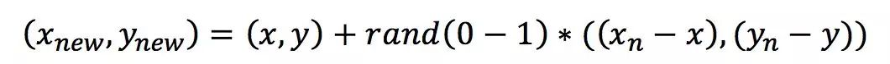

- **背景**：**类不平衡现象**指的是数据集中各类别数量不近似相等。如果样本类别之间相差很大，会影响分类器的分类效果。假设小样本数据数量极少，如仅占总体的1%，则即使小样本被错误地全部识别为大样本，在经验风险最小化策略下的分类器识别准确率仍能达到99%，但由于没有学习到小样本的特征，实际分类效果就会很差。
- #### （1）SMOTE
	- SMOTE即Synthetic Minority Over-sampling Technique（合成少数过采样技术），它是通过**人工合成新样本**来处理样本不平衡问题，从而提升分类器性能。
	- SMOTE方法是基于**插值**的方法，它可以**为小样本类合成新的样本**，主要流程为：（SMOTE通过在小样本类中的样本之间进行插值来生成新样本）
		- 第一步，定义好特征空间，将每个样本对应到特征空间中的某一点，根据样本不平衡比例确定好一个采样倍率N；
		- 第二步，对每一个**小样本类**样本(x,y)，按欧氏距离找出K个最近邻样本，从中随机选取一个样本点，假设选择的近邻点为(xn,yn)。在特征空间中样本点与最近邻样本点的连线段上随机选取一点作为新样本点，满足以下公式：
		- 
		- 第三步，重复以上的步骤，直到大、小样本数量平衡。
		- 在python中，SMOTE算法已经封装到了imbalanced-learn库中
-